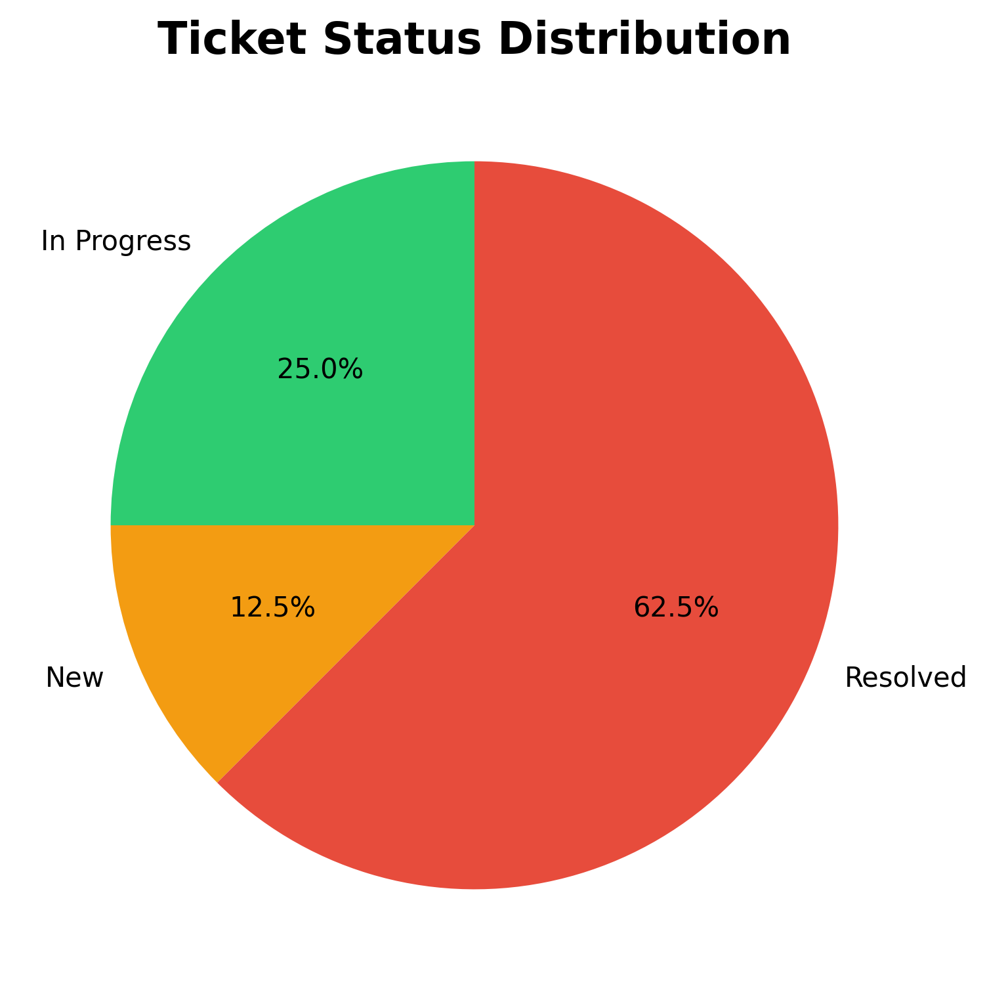
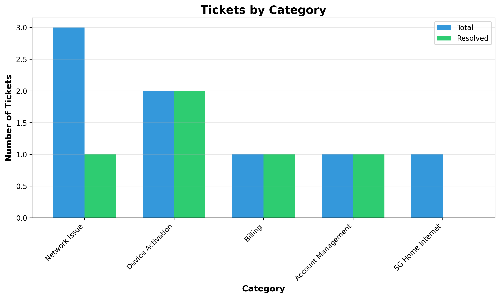
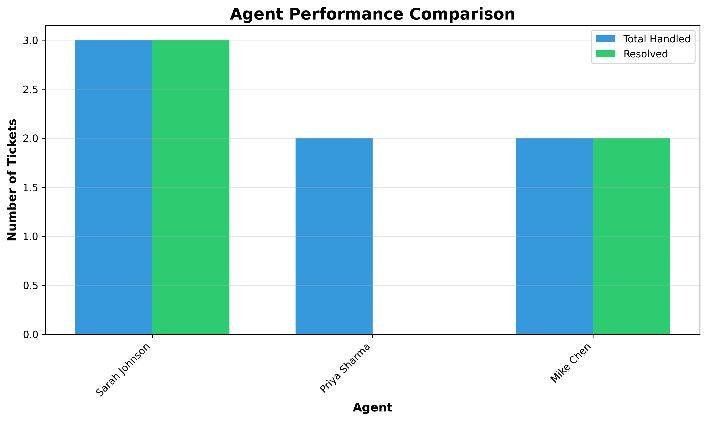

# Support Desk Analytics

A portfolio project demonstrating SQL database design, Python analytics, data visualization, and technical documentation skills for support operations.

## 📊 What This Does 

- **Database Management:** SQLite database tracking support tickets, customers, agents, and categories
- **Data Analytics:** Python scripts using pandas to analyze ticket metrics and performance
- **Visualizations:** Automated report generation with matplotlib charts
- **Documentation:** Professional knowledge base with troubleshooting guides


## 🛠️ Tech Stack

- **Database:** SQLite
- **Language:** Python 3.8+
- **Libraries:** pandas, matplotlib
- **Documentation:** Markdown


## 📈 Sample Visualizations

### Ticket Status Distribution


### Tickets by Category


### Agent Performance Comparison


## 📖 Knowledge Base

The project includes professional support documentation:

- **[Common Issues Quick Reference](knowledge_base/common_issues.md)** - Fast solutions for frequent problems
- **[Network Connectivity Guide](knowledge_base/troubleshooting_guides/network_connectivity.md)** - Detailed troubleshooting for 5G/LTE issues
- **[Device Activation Guide](knowledge_base/troubleshooting_guides/device_activation.md)** - Complete activation procedures

All documentation written in Markdown - the industry standard format used by GitHub, Confluence, and modern documentation platforms.

## 💡 Skills Demonstrated

- ✅ **SQL Database Design** - Schema creation, relationships, indexes, views
- ✅ **Python Programming** - Scripts for data analysis and automation
- ✅ **Data Analysis** - Using pandas for metrics calculation
- ✅ **Data Visualization** - Charts and graphs with matplotlib
- ✅ **Technical Documentation** - Professional troubleshooting guides
- ✅ **Support Workflows** - Understanding of tickets, SLA, escalations, triage
- ✅ **Version Control** - Git workflow and repository management


## 🔄 Sample Analytics Output
```
SUMMARY METRICS
----------------------------------------------------------------------
 total_tickets  resolved  in_progress  new_tickets  critical  high_priority
             8         5            2            1         1              4

Resolution Rate: 62.5%

TICKETS BY CATEGORY
----------------------------------------------------------------------
       category_name  ticket_count  resolved
       Network Issue             3         1
   Device Activation             2         2
             Billing             1         1
    5G Home Internet             1         0
  Account Management             1         1
```

## 🎯 Use Cases

This project demonstrates capabilities relevant to:
- **Support Analyst** roles - Ticket triage, documentation, workflow understanding
- **Technical Support** positions - Troubleshooting methodology, escalation criteria
- **Data Analysis** roles - SQL querying, metrics calculation, visualization
- **Documentation** roles - Technical writing, knowledge base creation


## 👤 About

Created as a portfolio project to demonstrate technical support, data analysis, and documentation capabilities.

**Author:** Prashanth Matangi  
**Contact:** prashanth.matangi5@gmail.com  
**LinkedIn:** linkedin.com/in/prashanth-matangi/  
**Location:** Hyderabad, India

## 📄 License

MIT License - Feel free to use this project as a reference for your own work.

---

*This is a demonstration project with simulated data. All ticket examples are fictional.*